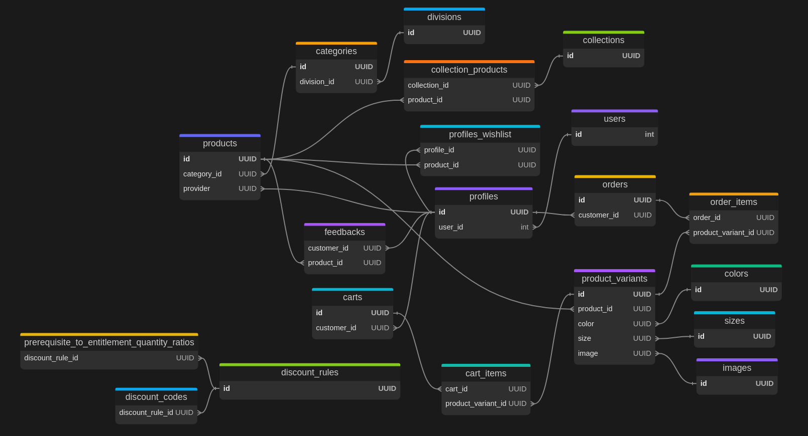
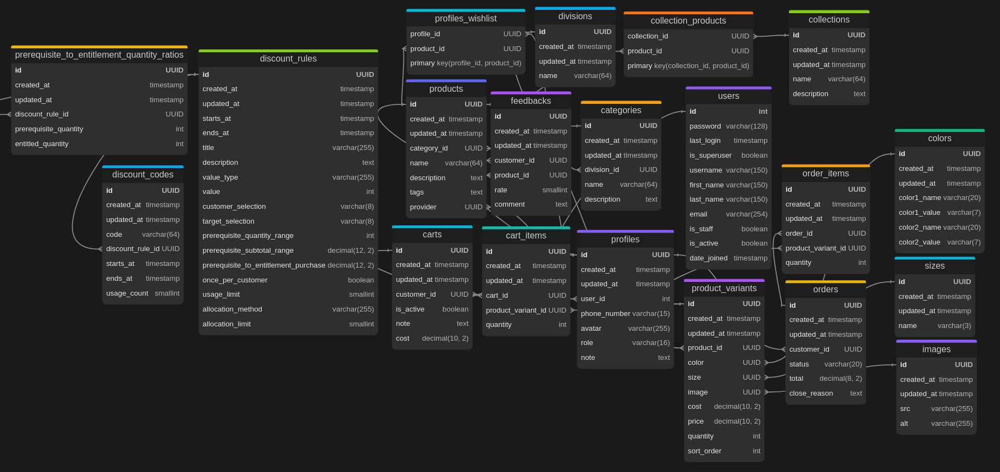

# **Maryema**

## **Overview**

This is the backend part of `maryema` web application.

## **Apps**

### **profile**

#### **Models**

| The model                                                                           | Description                                                                                 |
| ----------------------------------------------------------------------------------- | ------------------------------------------------------------------------------------------- |
| **[User](https://docs.djangoproject.com/en/5.1/topics/auth/default/#user-objects)** | The default user model provided by Django. It is used to store information about the users. |
| **[Profile](/profile/models.py#10)**                                                | Used to store additional information about the users of the application.                    |

#### **Views**

- List all users.
  ```http
  GET /api/admin/users/?
  page=<int:page>&
  search=<str:search>&
  role=<str:role>&
  is_active=<bool:is_active>
  ```
- Retrieve a specific user.
  ```http
  GET /api/admin/users/<int:id>/
  ```
- Create a new user.
  ```http
  POST /api/admin/users/
  ```
  ```json
  {
    "username": "user",
    "email": "user@test.com",
    "password": "password",
    "first_name": "User",
    "last_name": "Test",
    "profile": {
      "role": "customer",
      "phone_number": "1234567890",
      "avatar": "https://example.com/avatar.jpg",
      "note": "A test note"
    }
  }
  ```
- Update an existing user.
  ```http
  PUT /api/admin/users/<int:id>/
  PATCH /api/admin/users/<int:id>/
  ```
  ```json
  {
    "username": "user",
    "email": "user@test.com",
    "password": "password",
    "first_name": "User",
    "last_name": "Test",
    "profile": {
      "role": "customer",
      "phone_number": "1234567890",
      "avatar": "https://example.com/avatar.jpg",
      "note": "A test note"
    }
  }
  ```
- Delete a user.
  ```http
  DELETE /api/admin/users/<int:id>/
  ```
- Get current user profile.
  ```http
  GET /api/me/
  ```
- Update current user profile.
  ```http
  PATCH /api/me/
  ```
  ```json
  {
    "username": "user",
    "email": "user@test.com",
    "password": "password",
    "first_name": "User",
    "last_name": "Test",
    "profile": {
      "role": "customer",
      "phone_number": "1234567890",
      "avatar": "https://example.com/avatar.jpg",
      "note": "A test note"
    }
  }
  ```
- Delete current user.
  ```http
  DELETE /api/me/
  ```
- Change current user password
  ```http
  POST /api/me/change-password/
  ```
  ```json
  {
    "old_password": "old_password",
    "new_password": "new_password"
  }
  ```

### **product**

#### **Models**

| The model                                          | Description                                                                                           |
| -------------------------------------------------- | ----------------------------------------------------------------------------------------------------- |
| **[Division](/product/models/division.py)**        | used to divide the products into main divisions (such as, clothes and accessories).                   |
| **[Category](/product/models/category.py)**        | used to divide each division into categories to categorize the products.                              |
| **[Product](/product/models/product.py#20)**       | used to store the main information about the products.                                                |
| **[Color](/product/models/color.py#14)**           | used to store the colors available for the products.                                                  |
| **[Size](/product/models/size.py)**                | used to store the sizes available for the products.                                                   |
| **[Img](/product/models/image.py)**                | used to store the images of the products.                                                             |
| **[ProductVariant](/product/models/variant.py#7)** | used to store the variants of the products (the different color and size combination of the product). |
| **[Collection](/product/models/collection.py)**    | used to group the products, such as "summer collection" or "winter collection".                       |

#### **Views (TO DO)**

### **cart**

#### **Models**

| The model                          | Description                                                             |
| ---------------------------------- | ----------------------------------------------------------------------- |
| **[Cart](/cart/models.py#22)**     | used to store information about the cart of a customer.                 |
| **[CartItem](/cart/models.py#75)** | used to store the product variants and its quantity in a specific cart. |

#### **Views (TO DO)**

### **order**

#### **Models**

| The model                            | Description                                                              |
| ------------------------------------ | ------------------------------------------------------------------------ |
| **[Order](/order/models.py#14)**     | used to store information about the order.                               |
| **[OrderItem](/order/models.py#77)** | used to store the product variants and its quantity in a specific order. |

#### **Views (TO DO)**

### **discount**

#### **Models**

| The model                                                             | Description                                                                                                                                                                                               |
| --------------------------------------------------------------------- | --------------------------------------------------------------------------------------------------------------------------------------------------------------------------------------------------------- |
| **[DiscountRule](/discount/models.py#18)**                            | used to store the rules for the discount to be applicable and the tegeted products and customers.                                                                                                         |
| **[PrerequisiteToEntitlementQuantityRatio](/discount/models.py#238)** | used to store the ratio between the quantity of the prerequisite product and the quantity of the entitled product in BUY X GET Y discount type.                                                           |
| **[DiscountCode](/discount/models.py#300)**                           | used to store the codes of discount rules that will be used in carts to give the customer the fianl cost before checking out and to calculate the total price of the order if the discount is applicable. |

#### **Views (TO DO)**

### **feedback**

#### **Models**

| The model                              | Description                                                                                 |
| -------------------------------------- | ------------------------------------------------------------------------------------------- |
| **[Feedback](/feedback/models.py#21)** | used to store the feedback of the customer on a specific product, such as rate and comment. |

#### **Views (TO DO)**

## **Database Schema**

The database schema is defined using DBML (Database Markup Language) for better visualization and documentation. You can find the complete schema definition in:

- [Database Schema Definition (DBML)](/maryema_db.dbml)
- Database Schema Diagram (Images)
  - Realations: 
  - Details:

The schema is structured to support all the core functionalities of the application, including user management, product catalog, shopping cart, order processing, discount management, and customer feedback.

### Key Components:

- User Management: `users` and `profiles` tables
- Product Catalog: `divisions`, `categories`, `products`, `product_variants`, `sizes`, `colors`, and `images`
- Shopping: `carts`, `cart_items`, `orders`, and `order_items`
- Marketing: `collections`, `collection_products`, `discount_rules`, and `discount_codes`
- Customer Engagement: `feedbacks` and `profiles_wishlist`
